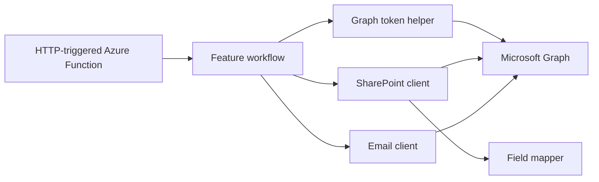

# Invoice Tracker Demo

This repository is a work-in-progress Azure automation project built around a simple idea: use Azure Functions to run invoice reminder workflows against invoice data stored in SharePoint, with Microsoft Graph handling both data access and email delivery.

It is also being shaped as a reusable template repo. The goal is not just to prove that one reminder can be sent, but to establish a maintainable structure for building multiple reminder workflows with shared Azure infrastructure, deployment automation, security defaults, and integration clients.

## What This Project Demonstrates

- Azure Functions v4 with Node.js and TypeScript
- Bicep-based Azure infrastructure
- GitHub Actions deployment using OIDC instead of static Azure secrets
- Microsoft Graph app-only authentication
- SharePoint list reads via Graph
- Email sending via Graph
- Separation of concerns between function handlers, feature workflows, integration clients, and field mapping

## Current Status

The repository is intentionally ahead in architecture and deployment setup, while the main business workflow is still being filled in.

Implemented now:

- Azure infrastructure for a Linux Function App, Storage Account, Key Vault, Log Analytics, Application Insights, and a user-assigned managed identity
- GitHub Actions workflows for validation and environment-based deployment
- Graph token acquisition helper
- SharePoint client for reading list items
- Email client for Graph `sendMail`
- Mapping layer for converting SharePoint internal fields into invoice-friendly names
- Scaffolded Azure Function entrypoint for the overdue reminder flow

Still in progress:

- Full overdue reminder workflow orchestration
- Business rules for filtering, pacing, and duplicate-send protection
- More complete tests around workflow behavior

## Architecture

The repo is structured around a thin-handler pattern.

- `functions/` holds Azure Function entrypoints and trigger registration
- `functions/<feature>/` holds feature-specific business workflow code
- `clients/` holds external I/O code for Graph and SharePoint access
- `tools/` holds shared low-level helpers such as auth/token acquisition
- `mapper/` holds transformations from raw SharePoint fields to application-friendly objects

This keeps transport concerns, business logic, integration logic, and data transformation from collapsing into a single file.



## Repository Layout

- `infra/`
  - Bicep template and per-environment parameter files
- `invoice-tracker-functions/`
  - Azure Functions application
- `invoice-tracker-functions/src/functions/`
  - Function handlers and feature-local workflow folders
- `invoice-tracker-functions/src/clients/`
  - Graph-backed integration clients
- `invoice-tracker-functions/src/tools/`
  - Shared helper modules
- `invoice-tracker-functions/src/mapper/`
  - SharePoint-to-domain mapping code
- `docs/`
  - Step-by-step setup, deployment, troubleshooting, and handover notes
- `sample-data/`
  - Demo invoice data for SharePoint import/testing

## Key Files

- [infra/main.bicep](./infra/main.bicep)
- [invoice-tracker-functions/src/functions/sendOverdueReminderEmails.ts](./invoice-tracker-functions/src/functions/sendOverdueReminderEmails.ts)
- [invoice-tracker-functions/src/functions/sendOverdueReminderEmails/runOverdueReminderEmailsWorkflow.ts](./invoice-tracker-functions/src/functions/sendOverdueReminderEmails/runOverdueReminderEmailsWorkflow.ts)
- [invoice-tracker-functions/src/clients/sharepointClient.ts](./invoice-tracker-functions/src/clients/sharepointClient.ts)
- [invoice-tracker-functions/src/clients/emailClient.ts](./invoice-tracker-functions/src/clients/emailClient.ts)
- [invoice-tracker-functions/src/tools/getGraphAccessToken.ts](./invoice-tracker-functions/src/tools/getGraphAccessToken.ts)
- [invoice-tracker-functions/src/mapper/mapInvoiceFields.ts](./invoice-tracker-functions/src/mapper/mapInvoiceFields.ts)
- [scripts/bootstrap-client.sh](./scripts/bootstrap-client.sh)

## Local Development

Prerequisites:

- Node.js 22
- npm
- Azure Functions Core Tools
- Azure CLI

Use the pinned Node version:

```bash
nvm use
```

Install and run the function app:

```bash
cd invoice-tracker-functions
npm ci
npm run start
```

The function app reads runtime configuration from `invoice-tracker-functions/local.settings.json` when running locally. The main settings used by the current integration layer are:

- `GRAPH_TENANT_ID`
- `GRAPH_CLIENT_ID`
- `GRAPH_CLIENT_SECRET`
- `GRAPH_SCOPE`
- `SHAREPOINT_SITE_ID`
- `SHAREPOINT_LIST_ID`
- `SHARED_MAILBOX`

The current HTTP function scaffold can be invoked locally with:

```bash
curl -X POST http://localhost:7071/api/send-overdue-reminder-email
```

## Azure Deployment

The deployment path is designed for repeatability across environments and client projects.

1. Update the correct parameter file in `infra/`
2. Bootstrap the Azure resource group and initial infrastructure
3. Configure GitHub environment variables and OIDC federation
4. Push to the target branch to deploy the function app

Bootstrap dev infrastructure:

```bash
./scripts/bootstrap-client.sh dev
```

The GitHub workflows currently included are:

- `.github/workflows/validate-template.yml`
- `.github/workflows/deploy-dev.yml`
- `.github/workflows/deploy-prod.yml`

## Docs Map

For the full setup and handover path, read these in order:

1. [docs/00-start-here.md](./docs/00-start-here.md)
2. [docs/01-bootstrap-dev.md](./docs/01-bootstrap-dev.md)
3. [docs/02-github-oidc-deploy.md](./docs/02-github-oidc-deploy.md)
4. [docs/03-promote-to-prod.md](./docs/03-promote-to-prod.md)
5. [docs/04-graph-sharepoint-integration.md](./docs/04-graph-sharepoint-integration.md)
6. [docs/05-secrets-runtime-local.md](./docs/05-secrets-runtime-local.md)
7. [docs/06-troubleshooting.md](./docs/06-troubleshooting.md)
8. [docs/07-security-handover.md](./docs/07-security-handover.md)

## Why It Is Structured This Way

This project is intended to support multiple automation flows, not just one endpoint. That is why the repo is split into reusable infrastructure and integration modules on one side, and feature-specific workflow folders on the other. The design choice is deliberate: it should be easy to add another reminder flow with different SharePoint filters, different email rules, and different orchestration logic without rewriting the foundation each time.

## Next Steps

- Complete the overdue reminder workflow implementation
- Add workflow-level tests around decision logic
- Introduce idempotency safeguards to reduce duplicate sends
- Improve operational visibility with richer logs and alerts
- Extend the template to support multiple reminder workflows cleanly

## Deep Reference

Long-form operational notes live in [knowledgeBase.md](./knowledgeBase.md).
