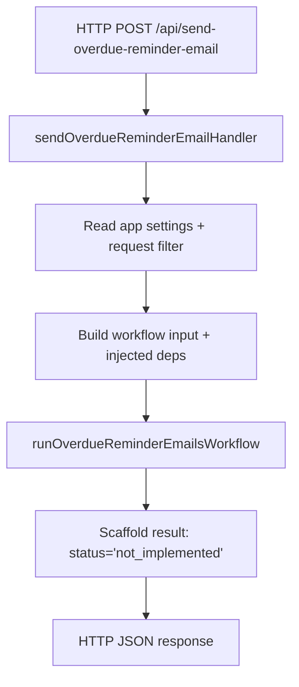

# Invoice Reminder Module

This folder contains the current scaffold for the overdue reminder email feature.

## Files

- `../sendOverdueReminderEmails.ts`
  - HTTP trigger entrypoint.
  - Reads `process.env`, validates request input, and builds workflow dependencies.
- `runOverdueReminderEmailsWorkflow.ts`
  - Feature workflow scaffold.
  - Defines the dependency contract, workflow input, and placeholder result shape.
- `../../tools/getGraphAccessToken.ts`
  - Requests a Microsoft Graph token from explicit config values.
- `../../clients/sharepointClient.ts`
  - Reads SharePoint list items from Microsoft Graph using explicit parameters.
- `../../clients/emailClient.ts`
  - Sends email through Microsoft Graph using explicit parameters.
- `../../mapper/mapInvoiceFields.ts`
  - Maps raw SharePoint internal field names into the invoice reminder domain model.

## Runtime Entry Point

The HTTP trigger is in:
- `../sendOverdueReminderEmails.ts`

That handler currently:
- reads runtime settings such as `GRAPH_TENANT_ID`, `GRAPH_CLIENT_ID`, `SHAREPOINT_SITE_ID`, and `SHARED_MAILBOX`
- accepts an optional `filter` from the query string or JSON body
- injects `getGraphAccessToken`, `getSharePointListItems`, and `sendEmail` into the workflow
- returns a scaffolded `not_implemented` workflow result

## Flow Diagram

## Current Pattern

- The Azure Function handler owns `process.env` access and HTTP concerns.
- The workflow receives typed input and injected dependencies.
- The clients and token helper use explicit parameters and stay independent from Azure Function runtime globals.
- The business reminder rules are not implemented yet.

## Update Workflow

1. Implement the reminder rules inside `runOverdueReminderEmailsWorkflow.ts`.
2. Decide how the workflow will build reminder email subject/body per invoice.
3. Call the injected `getGraphAccessToken`, `getSharePointListItems`, and `sendEmail` dependencies from the workflow.
4. Run `npm run typecheck` from `invoice-tracker-functions`.
