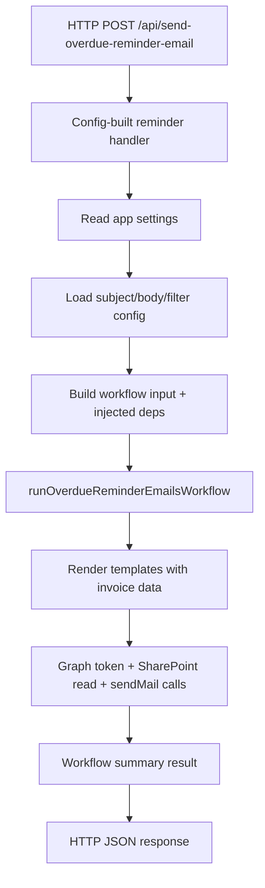

# Invoice Reminder Module

This folder contains the overdue reminder email feature implementation and its workflow contract.

## Files

- `../sendOverdueReminderEmails.ts`
  - HTTP trigger entrypoint.
  - Registers reminder handlers from JSON-backed config and keeps Azure Function wiring thin.
- `createReminderHandler.ts`
  - Builds a reusable HTTP handler from reminder config, runtime settings, and workflow dependencies.
- `reminderHandlerConfigs.json`
  - Stores per-function subject, body, and filter definitions.
- `runOverdueReminderEmailsWorkflow.ts`
  - Feature workflow.
  - Defines the dependency contract, workflow input, template rendering helpers, and the execution summary result shape.
- `../../tools/getGraphAccessToken.ts`
  - Requests a Microsoft Graph token from explicit config values and throws on prerequisite failure.
- `../../clients/sharepointClient.ts`
  - Reads SharePoint list items from Microsoft Graph using explicit parameters and throws on prerequisite failure.
- `../../clients/emailClient.ts`
  - Sends email through Microsoft Graph using explicit parameters and returns an item-level result.
- `../../tools/errorHandlers.ts`
  - Provides shared low-level error helpers used by the integration layer.
- `../../mapper/mapInvoiceFields.ts`
  - Maps raw SharePoint internal field names into the invoice reminder domain model.

## Runtime Entry Point

The HTTP trigger is in:
- `../sendOverdueReminderEmails.ts`

That handler currently:
- reads runtime settings such as `GRAPH_TENANT_ID`, `GRAPH_CLIENT_ID`, `SHAREPOINT_SITE_ID`, and `SHARED_MAILBOX`
- loads the subject, body, and filter from JSON-backed handler config
- injects `getGraphAccessToken`, `getSharePointListItems`, and `sendEmail` into the workflow
- returns a workflow summary with matched, sent, skipped, and failed counts

## Flow Diagram

## Current Pattern

- The Azure Function handler owns `process.env` access and HTTP concerns.
- Reminder-specific subject/body/filter values live in JSON-backed handler config.
- The workflow receives typed input and injected dependencies.
- The workflow renders supported placeholders such as `{ClientName}`, `{InvoiceNumber}`, `{InvoiceId}`, and `{DueDate}`.
- Token acquisition and SharePoint list reads throw on failure because the batch cannot continue without them.
- Email sends return a `SendEmailResult`, and the email client retries transient DNS failures before the workflow handles the final send outcome.
- Filters passed to the SharePoint client must use internal field names such as `field_13`.
- The workflow summary reports accepted send requests, not guaranteed mailbox delivery.
- The clients and token helper use explicit parameters and stay independent from Azure Function runtime globals.

## Update Workflow

1. Refine the reminder rules inside `runOverdueReminderEmailsWorkflow.ts`.
2. Update `reminderHandlerConfigs.json` or the workflow placeholder renderer when a reminder flow needs different messaging.
3. Call the injected `getGraphAccessToken`, `getSharePointListItems`, and `sendEmail` dependencies from the workflow.
4. Run `npm run typecheck` from `invoice-tracker-functions`.
