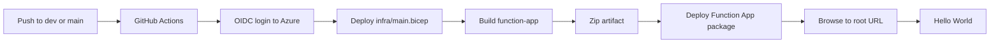

# Azure Functions Hello World Template Knowledge Base

Primary onboarding lives in:

- `README.md`
- `docs/00-start-here.md` through `docs/07-next-steps.md`

Use this file as the deeper reference for how the skeleton is put together.

## Goal

This repository is intentionally minimal. It exists to prove that:

1. Infrastructure can be deployed repeatably with Bicep
2. GitHub Actions can deploy to Azure through OIDC
3. The root Function App URL can return `Hello World`
4. Future features can be added on top of a clean baseline

## Repository Layout

- `function-app/`
  - Azure Functions app code, local settings sample, and starter test
- `infra/`
  - Bicep infrastructure template plus dev/prod parameter files
- `.github/workflows/`
  - Validation plus dev/prod deployments
- `scripts/bootstrap-environment.sh`
  - Resource-group bootstrap helper
- `.azure/plan.md`
  - Change plan for this template conversion

## Deployment Flow

## Runtime Flow

## Defaults

- Runtime: Azure Functions v4 on Node 22
- Hosting: Linux Consumption plan
- Observability: Application Insights backed by Log Analytics
- Route shape: root path `/`
- Auth for the starter endpoint: anonymous

## Recommended First Extension

After the starter deployment works:

1. Duplicate the pattern in `function-app/src/functions/helloWorld.ts`
2. Add new routes or triggers
3. Add only the Azure resources your feature actually needs
